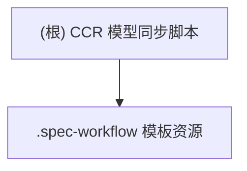

# CCR 模型同步脚本 · CLAUDE 报告

## 项目愿景
致力于提供一个可重复、可审计的本地工具链，用 Python + Bash 一键对 Claude Code Router (CCR) 的模型路由与 Claude Code 设置进行同步，并配套 Spec Workflow 模板，确保需求/设计文档的结构化沉淀。

## 架构总览
- **Python 助手 `ccr_helper.py`**：封装 JSON 读写与路由操作，暴露 `list`, `add_model`, `update_router(_all)`, `get_router_keys`, `update_settings` 等 CLI 子命令，直接操作 `~/.claude-code-router/config.json` 与 `~/.claude/settings.json`。
- **Bash 启动器 `sync_ccr.sh`**：通过 `uv run python` 调用助手脚本，提供交互式菜单（查看/新增模型、单路由或全量更新、自动应用并重启 `ccr`）。
- **安装脚本 `install.sh`**：将核心脚本复制到 `~/.local/share/ccr-switch/`，并生成全局 `ccrswitch` 命令（位于 `~/.local/bin`）以便任何目录下调用。
- **`.spec-workflow` 模板集**：一组默认 Markdown 模板（需求、设计、任务、产品、技术、结构）及 `user-templates/README.md`，通过“用户模板优先”机制供 Spec Workflow CLI 加载。
- **外部依赖**：`uv`、`python3`、`ccr` CLI 以及用户主目录下的 CCR/Claude 配置文件；在 VS Code 内可通过 `.vscode/settings.json` 推荐的 Conda 环境管理器快速定位解释器。

## 模块结构图

## 模块索引
| 模块路径 | 语言栈 | 职责概述 | 入口 / 关键脚本 | 测试现状 |
| --- | --- | --- | --- | --- |
| `.` | Python / Bash | 解析 CCR 配置、提供交互式模型切换与自动同步；`install.sh` 将能力包装成全局命令 | `ccr_helper.py`, `sync_ccr.sh`, `install.sh` | 仅人工回归，尚无 pytest / shell 自动化 |
| `.spec-workflow` | Markdown | 需求/设计/执行模板与用户覆盖机制，支撑 Spec Workflow 文档生成 | `templates/*.md`, `user-templates/README.md` | 文档型资产，无自动校验脚本 |

## 运行与开发
### 快速安装
1. `chmod +x install.sh && ./install.sh`：脚本会检测 `python3`、`uv`、`ccr`，随后将 `sync_ccr.sh` 与 `ccr_helper.py` 安装到 `~/.local/share/ccr-switch/`。
2. 自动创建的 `~/.local/bin/ccrswitch` 包装命令会调用安装目录中的 `sync_ccr.sh`，确保任意路径可执行。
3. 如 `$PATH` 未包含 `~/.local/bin`，遵循安装脚本提示将其加入 shell 配置。

### 本地调试
1. **直接调用助手**：`uv run python ccr_helper.py <命令>`，适合脚本化批量修改；命令参数与 `__main__` 判断保持一致。
2. **Bash 菜单**：在仓库或安装目录运行 `./sync_ccr.sh` 或 `ccrswitch`，通过菜单选择模型/路由；所有写操作后会调用 `apply_changes` 执行 `ccr restart` 并写回 Settings。
3. **配置预检**：确保 `~/.claude-code-router/config.json` 存在 `Providers`、`Router` 字段，且各路由值为 `provider,model` 形式，便于 `update_settings` 在缺省参数时推断默认模型。
4. **模板维护**：如需自定义 Spec Workflow 模板，先复制默认文件到 `.spec-workflow/user-templates/`，保持同名即可覆盖。

### 配置说明
- `~/.claude-code-router/config.json`：主数据源，包含 Providers/Models 列表与 Router 键值；Python 助手假定其结构固定。
- `~/.claude/settings.json`：`update_settings` 写入 `model` 字段，保持 Claude Code UI/CLI 与 CCR 默认一致。
- `.vscode/settings.json`：建议在 VS Code 中使用 Conda 作为默认 Python 环境管理器，可按需调整。
- `.spec-workflow/user-templates/README.md`：列出可覆盖文件名与支持的占位符（`{{projectName}}`, `{{featureName}}`, `{{date}}`, `{{author}}`）。

## 测试策略
- **当前人工步骤**：
  - 执行 `uv run python ccr_helper.py list`/`list_providers` 验证 JSON 解析。
  - 使用 `update_router_all` 与 `update_router` 在测试路由上写入临时值，并核对 `~/.claude-code-router/config.json` 差异。
  - 运行 `sync_ccr.sh` 选项 3/4，确认交互式选择 + `apply_changes`（含 `ccr restart`、`update_settings`）输出正常。
  - 安装后运行 `ccrswitch`，确认 wrapper 指向 `~/.local/share/ccr-switch/sync_ccr.sh`。
- **建议自动化**：
  - 为 `ccr_helper.py` 编写 `pytest` 用例，使用 `tmp_path` 与伪造 JSON 验证增删改逻辑。
  - 使用 `bats` 或 `expect` 驱动 `sync_ccr.sh` 菜单，配合 `uv run` 的 mock 输出。
  - 对 `install.sh` 进行 `shellcheck` 及临时 `$HOME` 沙箱安装测试。
  - 为 `.spec-workflow/templates` 编写小型渲染脚本，检测必备段落与占位符是否存在。

## 编码规范
- **Python**：保持函数粒度小、早返回；JSON 写入需 `ensure_ascii=False`，并对缺失字段显式报错退出。
- **Bash**：所有外部命令（`uv`, `ccr`）需存在性检查；变量引用使用双引号；函数内部复用 `run_helper`，避免重复参数解析。
- **文档/模板**：保持 Markdown 一级标题一致；如在 `user-templates/` 自定义，需注明版本/兼容性说明；模板中的 Prompt/Checklist 应避免泄露内部路径，可加上 `[项目自定义]` 提示。

## AI 使用指引
- 允许 AI 协助撰写/更新文档与模板说明，但禁止其直接改写 Python/Bash 源码与实际 CCR 配置。
- 分享配置前需移除真实 Provider/Model 名称，改用示例值（如 `provider_x/model_y`）。
- 若 AI 输出的模板结构与默认模板冲突，以 `.spec-workflow/templates` 为准，并记录差异在变更记录中。

## 变更记录 (Changelog)
- 2025-12-10 01:30：补充 `install.sh` 行为、`.spec-workflow` 各模板要点与当前测试缺口，完成全仓扫描并登记覆盖率。
- 2025-12-10：由 Claude Code 首次生成全局 CLAUDE 报告、模块索引与运行指南。
