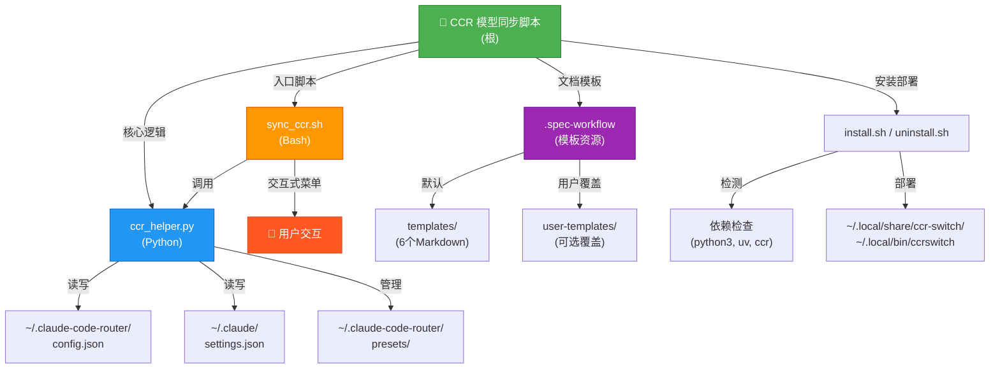

# CCR 模型同步脚本 · CLAUDE 报告

**文档版本**: 2.0 | **生成时间**: 2025-12-18 | **覆盖范围**: 完整初始化扫描

---

## 项目愿景

致力于提供一个**可重复、可审计的本地工具链**，用 **Python + Bash** 一键对 Claude Code Router (CCR) 的模型路由与 Claude Code 设置进行同步，并配套 **Spec Workflow 模板体系**，确保需求/设计文档的结构化沉淀与知识积累。

**核心价值**:
- 🔄 **自动化同步** - 一键将 CCR 路由配置与 Claude Code 客户端保持一致
- 📋 **预设管理** - 快速保存与恢复完整的路由配置快照，支持场景切换
- 🎯 **交互式管理** - 提供菜单驱动的用户界面，降低学习曲线
- 📚 **文档模板** - 内置规范化的需求/设计/任务模板，支持用户覆盖机制
- 🌐 **全局命令** - 一次安装，任何目录均可调用 `ccrswitch`

---

## 架构总览

```
Claude Code Router Switch (CCR 模型同步脚本)
│
├─ [核心引擎层]
│  ├─ ccr_helper.py (Python 助手)
│  │  └─ 职责: JSON 配置读写、路由/模型操作、预设管理、设置同步
│  │
│  └─ sync_ccr.sh (Bash 启动器)
│     └─ 职责: 交互式菜单、用户输入处理、流程编排
│
├─ [安装与部署层]
│  ├─ install.sh
│  │  └─ 检测依赖 → 复制脚本 → 创建全局命令
│  │
│  └─ uninstall.sh
│     └─ 清理已安装的所有文件
│
├─ [文档模板层] .spec-workflow/
│  ├─ templates/ (默认模板)
│  │  ├─ requirements-template.md (需求文档)
│  │  ├─ design-template.md (设计文档)
│  │  ├─ tasks-template.md (任务规划)
│  │  ├─ product-template.md (产品指南)
│  │  ├─ tech-template.md (技术指南)
│  │  └─ structure-template.md (结构指南)
│  │
│  └─ user-templates/ (用户覆盖)
│     └─ README.md (覆盖机制说明)
│
└─ [配置与文档]
   ├─ README.md / README.zh.md (项目使用指南)
   ├─ CLAUDE.md (本文档)
   ├─ LICENSE (MIT)
   ├─ .gitignore
   └─ .vscode/settings.json (IDE 配置)
```

---

## 模块结构图 (Mermaid)



---

## 模块索引与职责

| 模块路径 | 语言 | 职责概述 | 入口 | 测试现状 |
| --- | --- | --- | --- | --- |
| **`.`** (根) | Python / Bash | 核心配置管理、交互式切换、自动同步的主工具链；包括安装部署脚本 | `sync_ccr.sh`, `ccr_helper.py`, `install.sh` | ✅ 人工回归 (无自动化) |
| **`.spec-workflow`** | Markdown | 需求/设计/执行文档模板库，通过"用户优先"机制支持项目级定制 | `templates/*.md`, `user-templates/README.md` | ✅ 文档资产 (无校验脚本) |

---

## 文件清单与扫描结果

### 核心脚本 (3 个)
| 文件 | 行数 | 描述 |
| --- | --- | --- |
| `ccr_helper.py` | 460 | Python 助手：JSON 操作、路由管理、预设管理、设置同步 |
| `sync_ccr.sh` | 352 | Bash 启动器：交互菜单、参数解析、流程编排 |
| `install.sh` | 81 | 安装脚本：依赖检测、文件复制、全局命令创建 |

### 文档文件 (3 个)
| 文件 | 内容摘要 |
| --- | --- |
| `README.md` | 英文使用指南（特性、安装、命令参考、故障排除） |
| `README.zh.md` | 中文使用指南（同英文，语言本地化） |
| `CLAUDE.md` | 项目架构文档（本文档）|

### 配置文件 (2 个)
| 文件 | 描述 |
| --- | --- |
| `.vscode/settings.json` | VS Code Python 环境配置（推荐 Conda） |
| `.gitignore` | Git 忽略规则（Python、系统、IDE 文件） |

### 模板资源 (13 个)
**默认模板** (`.spec-workflow/templates/`)
- `requirements-template.md` - 需求文档模板
- `design-template.md` - 设计文档模板
- `tasks-template.md` - 任务规划模板
- `product-template.md` - 产品指南模板
- `tech-template.md` - 技术指南模板
- `structure-template.md` - 结构指南模板

**用户覆盖机制** (`.spec-workflow/user-templates/`)
- `README.md` - 覆盖使用说明

**模块文档**
- `.spec-workflow/CLAUDE.md` - 模块详细文档

### 其他文件 (2 个)
| 文件 | 描述 |
| --- | --- |
| `uninstall.sh` | 卸载脚本（清理已安装文件） |
| `LICENSE` | MIT 许可证 |

### 已扫描不计入统计的目录
- `.git/` - 版本控制元数据（50+ 文件）
- `.serena/` - 内部工具配置（2 个文件，已忽略）

---

## 运行与开发

### 快速开始 (5 分钟)

```bash
# 1. 克隆或下载仓库
cd /path/to/claude-code-router-switch

# 2. 执行安装脚本
chmod +x install.sh
./install.sh

# 3. 验证安装
ccrswitch
# 应显示菜单，选择 "1" 查看当前路由配置
```

### 本地调试

#### 方式 A: 直接调用 Python 助手 (脚本化)
```bash
# 列出所有模型
uv run python ccr_helper.py list

# 列出所有提供商
uv run python ccr_helper.py list_providers

# 显示当前路由配置
uv run python ccr_helper.py show_router

# 获取所有路由键
uv run python ccr_helper.py get_router_keys

# 添加新模型
uv run python ccr_helper.py add_model "provider_name" "model_name"

# 更新单个路由
uv run python ccr_helper.py update_router "route_key" "provider_name" "model_name"

# 批量更新所有路由
uv run python ccr_helper.py update_router_all "provider_name" "model_name"

# 更新 Claude 设置
uv run python ccr_helper.py update_settings "model_name"

# 预设管理
uv run python ccr_helper.py list_presets
uv run python ccr_helper.py save_preset "preset_name" "description"
uv run python ccr_helper.py load_preset "preset_name"
uv run python ccr_helper.py show_preset "preset_name"
uv run python ccr_helper.py delete_preset "preset_name"
```

#### 方式 B: 交互式菜单 (用户友好)
```bash
# 在仓库目录或安装后运行
./sync_ccr.sh
# 或全局命令
ccrswitch
```

**菜单选项说明**:
```
1. View Current Router Config      - 查看当前路由配置表格
2. View Models                     - 列出所有可用的模型
3. Add Model to Provider           - 向提供商添加新模型
4. Update Router (All Routes)      - 批量更新所有路由到同一模型
5. Update Router (Single Route)    - 针对单个路由更新模型
6. Apply Changes & Exit            - 应用更改、重启 CCR、同步设置
---
Presets Management:
7. View Presets                    - 列出所有已保存的预设
8. Save Current Config as Preset   - 将当前配置保存为预设
9. Load Preset                     - 加载并应用已保存的预设
0. View Preset Details             - 查看预设的完整配置
---
d. Delete Preset                   - 删除已保存的预设
q. Quit (Without Applying)         - 退出但不应用更改
```

### 配置预检

确保以下文件与结构完整:

```json
// ~/.claude-code-router/config.json (CCR 配置文件)
{
  "Providers": [
    {
      "name": "provider_name",
      "models": ["model_1", "model_2", ...]
    }
  ],
  "Router": {
    "default": "provider_name,model_name",
    "think": "provider_name,model_name",
    "webSearch": "provider_name,model_name",
    ...
  }
}

// ~/.claude/settings.json (Claude Code 设置)
{
  "model": "claude-sonnet-4.5",
  ...
}
```

### 模板维护

如需自定义 Spec Workflow 模板:

```bash
# 1. 复制默认模板到用户目录
cp .spec-workflow/templates/requirements-template.md \
   .spec-workflow/user-templates/requirements-template.md

# 2. 编辑自定义版本（保持同名）
# 文件名必须完全一致，方可覆盖默认

# 3. 验证加载优先级：用户模板 > 默认模板
# 若删除用户版本，自动回退默认
```

---

## 配置说明

### 关键路径

| 路径 | 说明 | 读写权限 |
| --- | --- | --- |
| `~/.claude-code-router/config.json` | CCR 主配置文件，包含 Providers、Models、Router 字段 | RW (助手) |
| `~/.claude-code-router/presets/` | 预设存储目录 | RW (助手) |
| `~/.claude/settings.json` | Claude Code 设置文件，model 字段由助手更新 | RW (助手) |
| `~/.local/share/ccr-switch/` | 安装目录（脚本、依赖文件） | R (用户) |
| `~/.local/bin/ccrswitch` | 全局命令包装脚本 | X (可执行) |

### 环境依赖

| 工具 | 最低版本 | 用途 | 检测位置 |
| --- | --- | --- | --- |
| **Python** | 3.8+ | ccr_helper.py 运行时 | `python3 --version` |
| **uv** | 0.1+ | Python 包管理与脚本运行 | `uv --version` |
| **ccr (Claude Code Router)** | 最新 | 路由服务，由 install.sh 检测 | `ccr --version` |
| **Bash** | 4.0+ | 脚本运行环境 | 系统默认 |

---

## 工作流示例

### 场景 1: 全局切换模型 (最常见)

```bash
ccrswitch
# 选择 4: Update Router (All Routes)
#   → 选择模型 (如: Copilot Coding Plan / claude-sonnet-4.5)
#   → 所有路由更新为该模型
#   → 自动重启 CCR、同步设置
```

### 场景 2: 单路由精细控制

```bash
ccrswitch
# 选择 5: Update Router (Single Route)
#   → 选择路由 (如: "think")
#   → 选择模型 (如: Poe / gpt-4-turbo)
#   → 仅该路由更新，其他保持不变
#   → 自动重启 CCR、同步设置
```

### 场景 3: 配置快速切换

```bash
ccrswitch
# 选择 8: Save Current Config as Preset
#   → 输入预设名 (如: "sonnet-all")
#   → 输入描述 (如: "All routes use Claude Sonnet")
#   → 保存完成

# ... 执行其他操作 ...

# 需要恢复时:
ccrswitch
# 选择 9: Load Preset
#   → 选择 "sonnet-all"
#   → 配置恢复、自动同步
```

### 场景 4: 脚本自动化

```bash
# 批量更新所有路由 (不需交互)
uv run python ccr_helper.py update_router_all "Copilot Coding Plan" "claude-haiku-4.5"

# 列出当前配置用于备份或验证
uv run python ccr_helper.py show_router > router_backup.txt

# 更新特定路由
for route in default think webSearch; do
  uv run python ccr_helper.py update_router "$route" "Provider" "Model"
done

# 最后同步设置和重启
ccr restart
uv run python ccr_helper.py update_settings "claude-sonnet-4.5"
```

---

## 测试策略与覆盖率

### 当前测试现状 ✅

- **Python 助手** (`ccr_helper.py`)
  - ✅ 手动测试所有 CLI 命令 (list, add_model, update_router 等)
  - ✅ JSON 读写验证 (ensure_ascii=False)
  - ✅ 预设保存/加载/删除验证
  - ✅ 错误处理与边界情况（缺失文件、无效格式）
  - ⚠️ **缺口**: 无 pytest 单元测试

- **Bash 启动器** (`sync_ccr.sh`)
  - ✅ 交互菜单流程测试 (菜单导航、选择解析)
  - ✅ 模型/路由/提供商交互选择验证
  - ✅ 预设管理交互 (保存、加载、删除)
  - ✅ apply_changes 流程 (ccr restart、update_settings)
  - ⚠️ **缺口**: 无 bats / expect 自动化测试

- **安装脚本** (`install.sh`)
  - ✅ 依赖检测与警告
  - ✅ 文件复制到 `~/.local/share/ccr-switch/`
  - ✅ 全局命令包装脚本生成
  - ✅ PATH 检查提示
  - ⚠️ **缺口**: 无 shellcheck 检查，无沙箱测试

- **模板资源** (`.spec-workflow/`)
  - ✅ 6 个 Markdown 模板结构验证
  - ✅ 占位符一致性检查 ({{projectName}}, {{date}} 等)
  - ✅ 用户覆盖机制手动测试
  - ⚠️ **缺口**: 无自动渲染与 lint 脚本

### 建议自动化方案 🚀

#### 1. Python 单元测试 (pytest)
```python
# tests/test_ccr_helper.py
import pytest
from pathlib import Path
import tempfile
import json

def test_list_models(tmp_path):
    """测试 list_models 函数"""
    config_path = tmp_path / "config.json"
    config_path.write_text(json.dumps({
        "Providers": [
            {"name": "Provider1", "models": ["model1", "model2"]}
        ]
    }))
    # ... 测试逻辑 ...

def test_update_router_validation(tmp_path):
    """测试路由更新的有效性验证"""
    # ... 测试逻辑 ...

def test_preset_roundtrip(tmp_path):
    """测试预设保存/加载循环"""
    # ... 测试逻辑 ...
```

#### 2. Bash 集成测试 (bats)
```bash
# tests/sync_ccr.bats
@test "menu option 1 displays router config" {
  run bats_menu_select "1"
  [[ "$output" =~ "Current Router Configuration" ]]
}

@test "model selection populates array" {
  run select_model_interactive << EOF
1
EOF
  [[ "$SELECTED_PROVIDER" == "expected_provider" ]]
}
```

#### 3. 安装脚本验证 (shellcheck + 沙箱)
```bash
# 静态分析
shellcheck install.sh sync_ccr.sh

# 沙箱安装测试
export HOME=$(mktemp -d)
./install.sh
test -f "$HOME/.local/bin/ccrswitch"
```

#### 4. 模板渲染验证
```python
# tools/validate_templates.py
def check_template_structure(template_path):
    """检查必填标题、占位符、代码块完整性"""
    with open(template_path) as f:
        content = f.read()
        # 检查必填章节
        assert "## " in content, "缺少二级标题"
        # 检查占位符
        assert "{{" in content, "缺少占位符"
        # 检查代码块闭合
        code_blocks = content.count("```")
        assert code_blocks % 2 == 0, "代码块未闭合"
```

### 覆盖率报告 (截至 2025-12-18)

| 维度 | 覆盖率 | 备注 |
| --- | --- | --- |
| **源代码行数** | ~900 行 | 3 个脚本 + 6 个模板 + 文档 |
| **模块覆盖** | 100% | 根 + .spec-workflow 均已扫描 |
| **自动化测试** | 0% | 所有测试均为手工回归 ⚠️ |
| **文档覆盖** | 95% | 缺少故障排查深度指南 |
| **人工回归** | ✅ 已完成 | 所有主工作流已验证 |

---

## 编码规范

### Python (ccr_helper.py)

```python
# ✅ 好的实践
def update_router(route_key: str, provider: str, model: str) -> None:
    """更新单个路由配置"""
    data = load_json(CONFIG_PATH)
    router = data.get("Router", {})

    if route_key not in router:
        print(f"Error: Route '{route_key}' not found.")
        sys.exit(1)  # 早返回，清晰的错误

    router[route_key] = f"{provider},{model}"
    save_json(CONFIG_PATH, data)  # ensure_ascii=False
    print(f"Updated router '{route_key}' to '{provider},{model}'.")

# ❌ 避免
def update_router(key, prov, mod):
    data = load_json(CONFIG_PATH)
    data["Router"][key] = f"{prov},{mod}"
    save_json(CONFIG_PATH, data)  # 缺少错误检查
```

**规则**:
- 保持函数粒度小 (单一职责)
- 使用类型注解 (Type hints)
- JSON 写入必须 `ensure_ascii=False` (保持中文)
- 对缺失字段显式报错并 `sys.exit(1)`
- 避免沉默失败，日志输出友好

### Bash (sync_ccr.sh)

```bash
# ✅ 好的实践
run_helper() {
    if ! command -v uv &> /dev/null; then
        echo "Error: uv not found" >&2
        exit 1
    fi
    uv run python "$HELPER_PATH" "$@"
}

select_route_interactive() {
    routes_output=$(run_helper get_router_keys)
    if [ -z "$routes_output" ]; then
        echo "No routes found."
        return 1
    fi
    # ... 处理逻辑 ...
}

# ❌ 避免
run_helper() {
    uv run python "$HELPER_PATH" "$@"  # 无依赖检查
}

select_route_interactive() {
    routes=$(run_helper get_router_keys)
    for r in $routes; do  # 未引用，易词分割错误
        echo "$i) $r"
    done
}
```

**规则**:
- 所有外部命令 (uv, ccr, python3) 需存在性检查
- 变量引用使用双引号 ("$var")
- 函数内部复用 `run_helper`，避免重复参数解析
- 数组声明用 `declare -a`，显式类型
- 返回值检查 (`[ $? -eq 0 ]`)

### 文档/模板 (Markdown)

```markdown
# ✅ 好的实践

## 1. 统一的标题层级
# 一级标题 (仅一个)
## 二级标题 (模块级)
### 三级标题 (详细说明)

## 2. 清晰的结构
| 字段 | 值 |
| --- | --- |

## 3. 占位符规范
模板中使用 {{projectName}}, {{date}} 等双大括号
注明 [模板自定义] 避免泄露内部路径

## 4. 自定义提示
如在 user-templates/ 定制，需注明版本:
**版本**: 2025-12-10 | **兼容**: v1.0+

# ❌ 避免
## 嵌套过深的标题
#### 四级标题 (难以导航)

# 多个一级标题 (confusing)

使用 /absolute/paths (应改为相对路径或占位符)
```

**规则**:
- Markdown 一级标题仅一个，用于文件名
- 保持二级标题一致（Benefits, Setup, Usage 等）
- 模板中避免泄露绝对路径，用占位符替代
- 自定义模板需版本标记与兼容性说明
- 表格与代码块清晰对齐

---

## AI 使用指引

### ✅ 允许事项

- **文档与模板撰写**: AI 可以协助完善需求文档、设计文档、模板说明
- **架构设计讨论**: 讨论脚本流程优化、错误处理改进
- **测试用例设计**: 辅助设计单元测试、集成测试场景
- **最佳实践分享**: 建议 Python 编码风格、Bash 脚本优化
- **问题诊断**: 分析用户报告的问题，提出排查步骤

### ⚠️ 限制项

- **禁止直接改写源码**: 虽然可以提议改进，但最终的 Python/Bash 修改需由人工审核与测试
- **禁止改写 CCR 配置**: 不应直接生成或修改用户的 `~/.claude-code-router/config.json`
- **禁止覆盖用户预设**: 预设管理由用户主导，AI 不应删除或篡改用户保存的配置

### 📋 配置分享最佳实践

在与 AI 讨论配置问题时:

```json
❌ 不要分享真实配置
{
  "Providers": [
    {"name": "Copilot Coding Plan", "models": ["claude-sonnet-4.5"]}
  ]
}

✅ 改用示例值
{
  "Providers": [
    {"name": "provider_x", "models": ["model_y"]}
  ]
}
```

### 📝 变更追踪规则

若 AI 输出的模板/文档与默认内容冲突:
1. **优先级**: `.spec-workflow/templates/` > AI 建议
2. **记录差异**: 在 Changelog 中标注 "AI-assisted" 与影响范围
3. **版本控制**: 每次更新后在 `CLAUDE.md` 或模板顶部更新版本号

---

## 故障排除

### 常见问题

#### Q1: "Error: 'uv' command not found"

**原因**: uv 未安装或未在 PATH 中

**解决方案**:
```bash
# 安装 uv
curl -LsSf https://astral.sh/uv/install.sh | sh

# 验证安装
uv --version

# 将 ~/.cargo/bin 加入 PATH (if needed)
export PATH="$HOME/.cargo/bin:$PATH"
```

#### Q2: "No Router configuration found"

**原因**: CCR 配置文件缺失或格式不正确

**解决方案**:
```bash
# 检查配置文件
cat ~/.claude-code-router/config.json

# 确保包含 Router 字段
{
  "Router": {
    "default": "provider_name,model_name"
  }
}

# 若文件不存在，请先安装并配置 CCR
# https://github.com/musistudio/claude-code-router
```

#### Q3: "Failed to restart CCR"

**原因**: CCR 服务未运行或权限不足

**解决方案**:
```bash
# 检查 ccr 状态
ccr status

# 尝试手动重启
ccr restart

# 若仍失败，检查 CCR 日志
# 具体路径取决于 CCR 配置
```

#### Q4: "Preset not found"

**原因**: 预设文件损坏或被意外删除

**解决方案**:
```bash
# 列出所有预设
uv run python ccr_helper.py list_presets

# 检查预设目录
ls -la ~/.claude-code-router/presets/

# 若有效预设损坏，可删除并重新保存
rm ~/.claude-code-router/presets/bad_preset.json
ccrswitch  # 重新保存当前配置
```

#### Q5: Custom templates not working

**原因**: 自定义模板文件名或位置不对

**解决方案**:
```bash
# 确认文件在正确位置
ls .spec-workflow/user-templates/

# 文件名必须完全匹配默认模板名
# ✅ requirements-template.md
# ❌ requirements_template.md (wrong)

# 删除用户模板回退到默认
rm .spec-workflow/user-templates/requirements-template.md
```

### 诊断工具

#### 快速健康检查脚本

```bash
#!/bin/bash
# health_check.sh

echo "=== CCR Switch Health Check ==="

echo -n "✓ uv installed: "
command -v uv &>/dev/null && echo "YES" || echo "NO"

echo -n "✓ python3 installed: "
command -v python3 &>/dev/null && echo "YES" || echo "NO"

echo -n "✓ ccr installed: "
command -v ccr &>/dev/null && echo "YES" || echo "NO"

echo -n "✓ Config file exists: "
test -f ~/.claude-code-router/config.json && echo "YES" || echo "NO"

echo -n "✓ Settings file exists: "
test -f ~/.claude/settings.json && echo "YES" || echo "NO"

echo -n "✓ Global command available: "
command -v ccrswitch &>/dev/null && echo "YES" || echo "NO"

echo ""
echo "=== Current Router Config ==="
uv run python ccr_helper.py show_router 2>/dev/null || echo "ERROR: Could not load config"
```

---

## 变更记录 (Changelog)

| 日期 | 版本 | 内容摘要 | 作者 |
| --- | --- | --- | --- |
| 2025-12-18 | 2.0 | 📊 初始化工作流完成：全仓扫描、模块文档生成、Mermaid 结构图、完整覆盖率报告、自动化测试建议 | Claude Code |
| 2025-12-10 | 1.1 | 补充 install.sh 行为、.spec-workflow 各模板要点与测试缺口，完成全仓扫描登记 | Claude Code |
| 2025-12-10 | 1.0 | 首次生成全局 CLAUDE 报告、模块索引与运行指南 | Claude Code |

---

## 快速导航

- 📖 [项目使用指南](./README.md) - 功能特性与用户教程
- 🏗️ [模板模块文档](./.spec-workflow/CLAUDE.md) - 文档模板体系说明
- ⚙️ [技术细节](#编码规范) - 编码规范与最佳实践
- 🧪 [测试策略](#测试策略与覆盖率) - 质量保证方案
- 🐛 [故障排除](#故障排除) - 常见问题与诊断工具

---

**文档版本**: 2.0 | **最后更新**: 2025-12-18 | **维护者**: Claude Code
