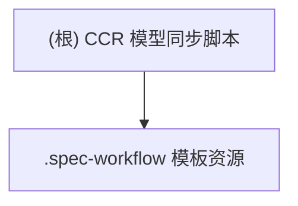

# CCR 模型同步脚本 · CLAUDE 报告

## 项目愿景
致力于在本地一键同步 Claude Code Router (CCR) 的模型配置，使多提供方、多模型的切换行为可审计、可重复，并配套 Spec Workflow 模板以沉淀需求/设计文档。

## 架构总览
- **Python 助手 `ccr_helper.py`**：直接读写 `~/.claude-code-router/config.json` 与 `~/.claude/settings.json`，提供列举、追加模型与更新路由的子命令。
- **Bash 启动器 `sync_ccr.sh`**：基于 `uv run python` 调用助手脚本，提供交互式菜单，同时负责在路由变更后执行 `ccr restart` 及 Settings 同步。
- **`.spec-workflow` 模板集**：存放默认与可覆盖的 Markdown 模板，通过“用户模板优先”机制复用。
- **外部依赖**：`uv`、`python`、`ccr` CLI 以及用户主目录下的配置文件。

## 模块结构图

## 模块索引
| 模块路径 | 语言栈 | 职责概述 | 入口 / 关键脚本 | 测试现状 |
| --- | --- | --- | --- | --- |
| `.` | Python / Bash | 读取并改写 CCR 路由、同步设置并触发 CCR 重启 | `ccr_helper.py`, `sync_ccr.sh` | 未发现自动化测试；目前依赖交互式人工验证 |
| `.spec-workflow` | Markdown | 需求/设计模板仓库，支持用户级覆盖 | `templates/*.md`, `user-templates/README.md` | 文档类型，不适用自动化测试 |

## 运行与开发
### 先决条件
1. 已安装 `uv`（脚本运行时即刻检查）。
2. 可用的 Python 运行时（由 `uv run python` 管理）。
3. `ccr` CLI（脚本在应用变更时调用 `ccr restart`）。
4. 目标机器需存在 `~/.claude-code-router/config.json` 与 `~/.claude/settings.json`。

### 常用流程
1. **列出可用模型/提供方**：`uv run python ccr_helper.py list`、`uv run python ccr_helper.py list_providers`。
2. **批量更新路由**：运行 `./sync_ccr.sh`，选择 “Update Router (All Routes)” 进入模型挑选，再批量写回。
3. **单路由定向**：在脚本中先选路由再选模型，会调用 `update_router`。
4. **应用并同步设置**：脚本选项 5 或任何完成更新的路径都会执行 `apply_changes`，其中包含 `ccr restart` 与 `update_settings`。

### 配置说明
- `~/.claude-code-router/config.json`：保存 Providers、Models、Router 键值。`ccr_helper.py` 假定顶层字段存在。
- `~/.claude/settings.json`：由 `update_settings` 覆写 `model` 字段，以保证 Claude Code GUI/CLI 与 Router 默认一致。
- `.vscode/settings.json`：提示首选 Python 环境管理器为 Conda，可据此配置本地 IDE。

## 测试策略
- 目前没有自动化测试。建议至少增加以下人工验证步骤：
  1. 使用 `ccr_helper.py list` 和 `list_providers` 验证 JSON 解析是否成功。
  2. 在测试路由上执行 `update_router`，随后检查 `config.json` 是否更新。
  3. 执行 `apply_changes` 后观察 `ccr restart` 与设置写入是否成功。
- 后续可引入：
  - 针对 `ccr_helper.py` 的单元测试（可使用 `pytest` + `tmp_path` 模拟配置文件）。
  - Shell 脚本的行为测试（如 `bats` 或 `expect`）。

## 编码规范
- Python：维持当前的函数式组织与早返回风格，遵循 PEP 8，并在读写 JSON 时保持 UTF-8/`ensure_ascii=False`。
- Shell：统一使用双引号包裹变量、防止路径带空格，同时对外部命令加上存在性检查（已在 `uv`、`ccr_helper.py` 中实现）。
- 文档模板：保持主版本中的标题顺序，若在 `user-templates/` 中覆盖，建议沿用相同文件名以触发优先级机制。

## AI 使用指引
- 仅授权 AI 协助补全文档与配置说明，禁止其直接修改 Python/Bash 源码或写入敏感凭据。
- 当需要 AI 参与配置建议时，先脱敏个人或企业路由键值，再提交分析。
- 若 AI 输出与现有模板冲突，应以 `.spec-workflow/templates` 为准，并记录在变更日志中。

## 变更记录 (Changelog)
- 2025-12-10：由 Claude Code 首次生成全局 CLAUDE 报告、模块索引与运行指南。
